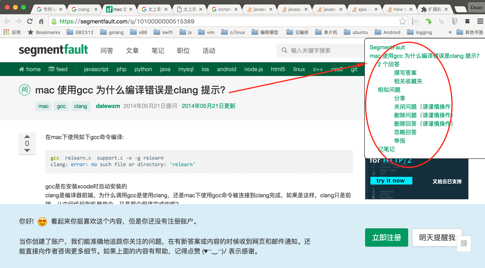

Intro
=====

PageMenu is a chrome extension that generates a menu for web pages that organize thire titles with "h1", "h2", "h3" and "h4" HTML tags.

An icon is provide to toggle show and hide of the menu so that it does not mask page contents.

A snapshot is given whose relative path is doc/snapshot.png

~/Desktop/page_menu>$ 
~/Desktop/page_menu>$ vi README.md 
~/Desktop/page_menu>$ cat README.md 
Intro
=====

PageMenu is a chrome extension that generates a menu for web pages that organize thire titles with "h1", "h2", "h3" and "h4" HTML tags.

An icon is provide to toggle show and hide of the menu so that it does not mask page contents.

A snapshot is given whose relative path is doc/snapshot.png

